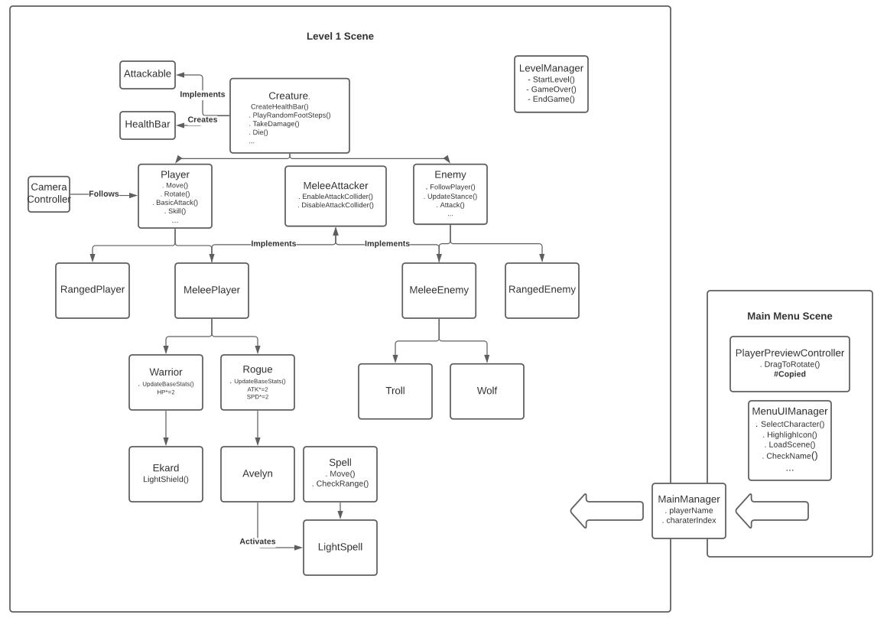
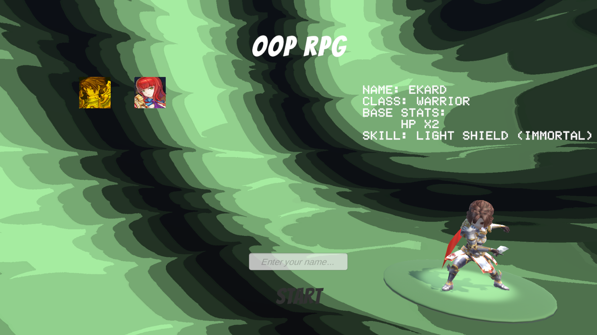
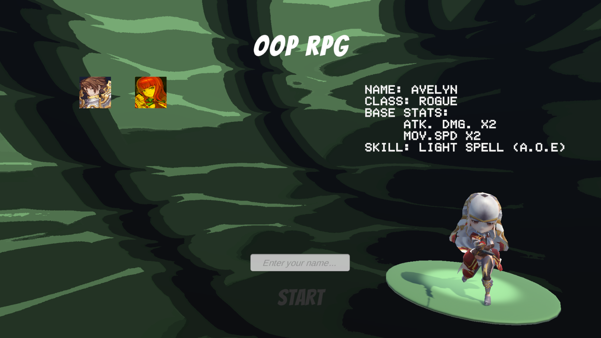
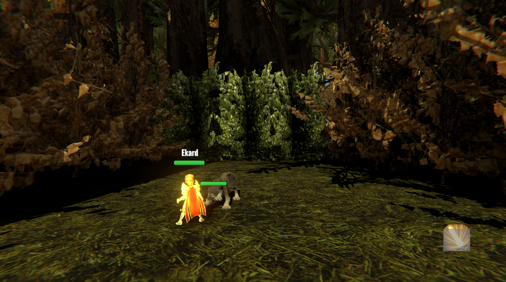
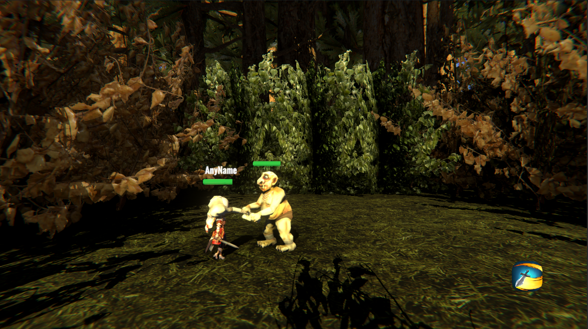

# OOP-RPG
Final project for Unity's programmer pathway
This is a demo for an RPG game for the last Unity's project in the junior programmer pathway.
The basic system is created to make use of OOP to the fullest to optimize the amount of code, performance and readability of the code.

**UML Class Diagram**

**Menu Screenshots**

**In Game Screenshots**

**What I have done**

- Made all scripts (Except PlayerPreviewController.cs) which enables rotation of Player in menu screen with mouse.
- Created 3D model using Blender3d, shadergraph using Amplify for the Light Spell.
- UML diagram using LucidCharts.

**Credits**

- PlayerPreviewController.cs: http://answers.unity.com/answers/177525/view.html
- Many thanks Unity Learn for providing a great course.
- Many thanks to Cutisbest from Unity asset store for Ekard, Avelyn, Wolf 3D models.
- Many thanks to Waytan from Unity asset store for Troll Cannibal 3d model.
- Many thanks to Nox_Sound from Unity asset store for providing a huge range of audio files for footsteps.
- Many thanks to IL.ranch from Unity asset store for providing Enviromental assets.
- Imported some sound effects from League of Legends, The Legend of Zelda Ocarina of Time and from Ｚｅｌｄａｗａｖｅ ＩＩ on YouTube by Marble Pawns.
